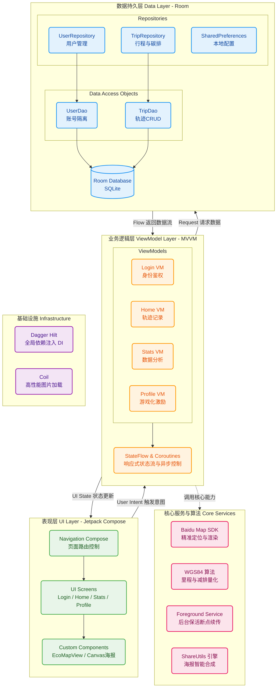

```mermaid
flowchart TD
    %% ==========================================
    %% 1. Theme and Styling Configuration
    %% ==========================================
    classDef layerBox fill:#ffffff,stroke:#e0e0e0,stroke-width:2px,color:#333333,rx:8,ry:8,font-weight:bold,font-size:16px;
    classDef uiNode fill:#e8f5e9,stroke:#4caf50,stroke-width:2px,color:#1b5e20,rx:6,ry:6;
    classDef vmNode fill:#fff3e0,stroke:#ff9800,stroke-width:2px,color:#e65100,rx:6,ry:6;
    classDef dataNode fill:#e3f2fd,stroke:#2196f3,stroke-width:2px,color:#0d47a1,rx:6,ry:6;
    classDef coreNode fill:#fce4ec,stroke:#e91e63,stroke-width:2px,color:#880e4f,rx:6,ry:6;
    classDef infraNode fill:#f3e5f5,stroke:#9c27b0,stroke-width:2px,color:#4a148c,rx:6,ry:6;

    %% ==========================================
    %% 2. Layer Definitions (Strict Top to Bottom)
    %% ==========================================

    %% --- Infrastructure ---
    subgraph Infra_Layer [基础设施 Infrastructure]
        direction LR
        Infra_Hilt[Dagger Hilt\n全局依赖注入 DI]:::infraNode
        Infra_Coil[Coil\n高性能图片加载]:::infraNode
    end
    class Infra_Layer layerBox

    %% --- Presentation Layer ---
    subgraph UI_Layer [表现层 UI Layer - Jetpack Compose]
        direction TB
        UI_Nav[Navigation Compose\n页面路由控制]:::uiNode
        UI_Screens[UI Screens\nLogin / Home / Stats / Profile]:::uiNode
        UI_Comp[Custom Components\nEcoMapView / Canvas海报]:::uiNode
        
        UI_Nav --> UI_Screens
        UI_Screens --> UI_Comp
    end
    class UI_Layer layerBox

    %% --- ViewModel Layer ---
    subgraph VM_Layer [业务逻辑层 ViewModel Layer - MVVM]
        direction TB
        subgraph VM_Controllers [ViewModels]
            direction LR
            VM_Login[Login VM\n身份鉴权]:::vmNode
            VM_Home[Home VM\n轨迹记录]:::vmNode
            VM_Stats[Stats VM\n数据分析]:::vmNode
            VM_Prof[Profile VM\n游戏化激励]:::vmNode
        end
        VM_State[StateFlow & Coroutines\n响应式状态流与异步控制]:::vmNode
        
        VM_Controllers --> VM_State
    end
    class VM_Layer layerBox

    %% --- Core Services ---
    subgraph Core_Layer [核心服务与算法 Core Services]
        direction LR
        Svc_Baidu[Baidu Map SDK\n精准定位与渲染]:::coreNode
        Svc_Algo[WGS84 算法\n里程与减排量化]:::coreNode
        Svc_Bg[Foreground Service\n后台保活断点续传]:::coreNode
        Svc_Draw[ShareUtils 引擎\n海报智能合成]:::coreNode
    end
    class Core_Layer layerBox

    %% --- Data Layer ---
    subgraph Data_Layer [数据持久层 Data Layer - Room]
        direction TB
        subgraph Repos [Repositories]
            direction LR
            Repo_User[UserRepository\n用户管理]:::dataNode
            Repo_Trip[TripRepository\n行程与碳排]:::dataNode
            Prefs[SharedPreferences\n本地配置]:::dataNode
        end
        
        subgraph DAOs [Data Access Objects]
            direction LR
            DAO_User[UserDao\n账号隔离]:::dataNode
            DAO_Trip[TripDao\n轨迹CRUD]:::dataNode
        end
        
        DB_Room[(Room Database\nSQLite)]:::dataNode
        
        Repo_User --> DAO_User
        Repo_Trip --> DAO_Trip
        DAO_User --> DB_Room
        DAO_Trip --> DB_Room
    end
    class Data_Layer layerBox

    %% ==========================================
    %% 3. Cross-Layer Relationships (Strict Ordering)
    %% ==========================================
    
    Infra_Layer ~~~ UI_Layer
    UI_Layer -->|User Intent 触发意图| VM_Layer
    VM_Layer -->|UI State 状态更新| UI_Layer
    
    VM_Layer -.->|调用核心能力| Core_Layer
    
    VM_Layer -->|Request 请求数据| Data_Layer
    Data_Layer -->|Flow 返回数据流| VM_Layer

```