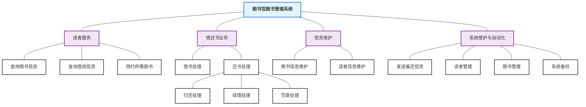

```mermaid
graph TD
    %% 顶层：系统名称
    Root[图书馆图书管理系统]

    %% 第一层：按照角色或核心业务划分的大模块
    Root --- M1[读者服务]
    Root --- M2[借还书业务]
    Root --- M3[信息维护]
    Root --- M4[系统维护与自动化]

    %% 第二层：具体功能子模块

    %% 1. 读者服务
    M1 --- M1_1[查询图书信息]
    M1 --- M1_2[查询借阅信息]
    M1 --- M1_3[预约所需图书]

    %% 2. 借还书业务
    M2 --- M2_1[借书处理]
    M2 --- M2_2[还书处理]
    M2_2 --- M2_2_1[归还处理]
    M2_2 --- M2_2_2[续借处理]
    M2_2 --- M2_2_3[罚款处理]

    %% 3. 信息维护 (工作人员)
    M3 --- M3_1[图书信息维护]
    M3 --- M3_2[读者信息维护]

    %% 4. 系统维护与自动化 (管理员 & 系统自动)
    M4 --- M4_1[发送催还信息]
    M4 --- M4_2[读者管理]
    M4 --- M4_3[图书管理]
    M4 --- M4_4[系统备份]

    %% 样式调整，使其看起来更像层次图
    classDef default fill:#fff,stroke:#333,stroke-width:2px;
    classDef rootStyle fill:#e1f5fe,stroke:#1565c0,stroke-width:2px,font-weight:bold;
    classDef moduleStyle fill:#f3e5f5,stroke:#7b1fa2,stroke-width:2px;
    
    class Root rootStyle;
    class M1,M2,M3,M4 moduleStyle;
```